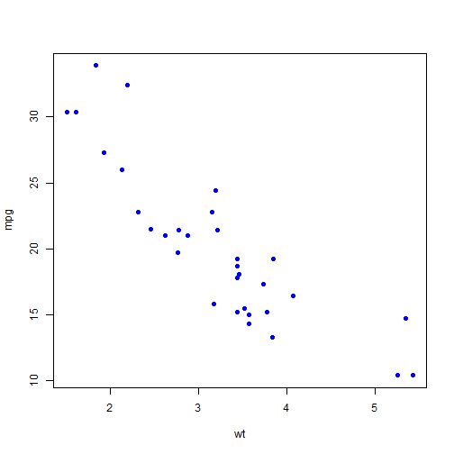
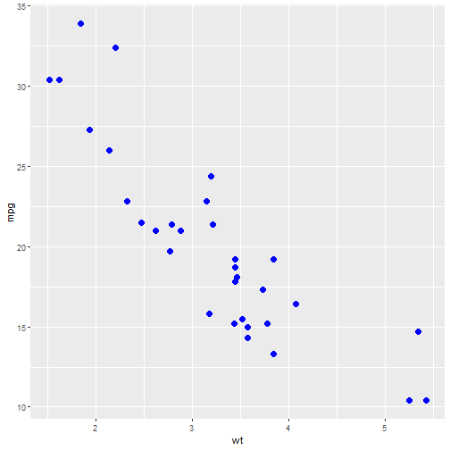
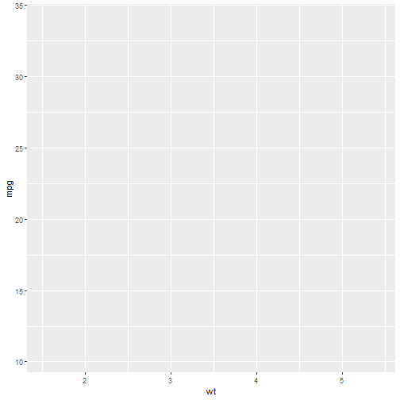
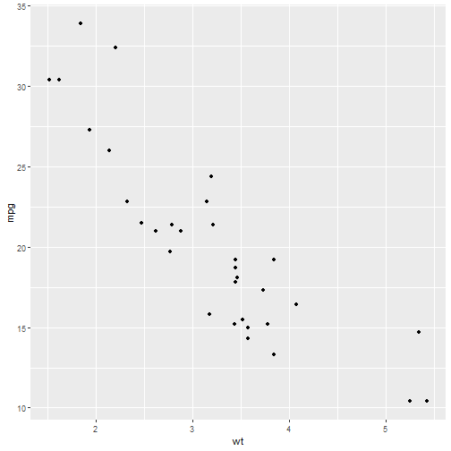
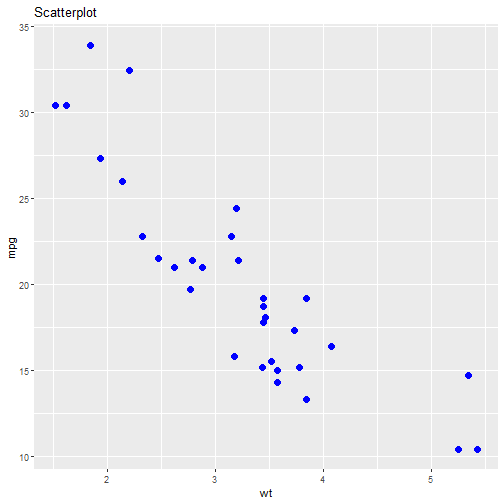
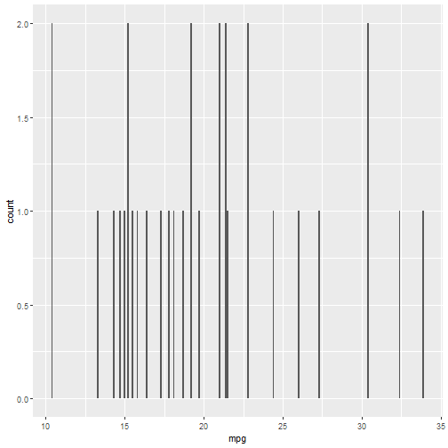
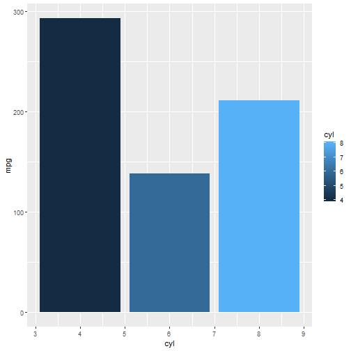
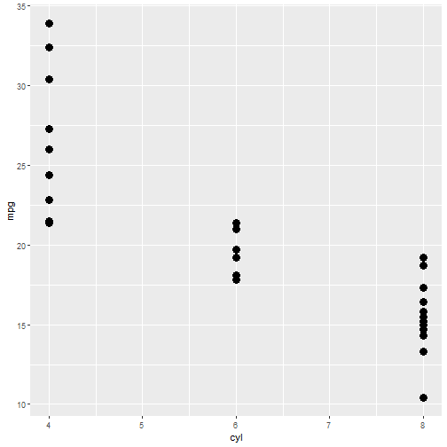

Introduction to data Visualization in R
========================================================

Nilanjan Chatterjee  
February, 2020

Topics
========================================================
- What is data visualization?
- Why is data visualization important?
- How to do data visualization?
- Possible options and pitfalls

What is data visualization?
========================================================
Technique to communicate insights from data through visual representation.  
Allow easy understanding of large dataset.  
Provides basic knowledge about variables.  
Most efficient way to identify, locate, manipulate, format, and present data.

Why data visualization is important?
========================================================
- Ever increasing amount of data.  
- Humanly impossible to see distinct patterns.  
- Improved insight.  
- Faster Decision making.  

How to do data visualization?
========================================================
- Plot in Base R
- ggplot2 package and associates

```r
data(mtcars)
plot(mpg~wt, mtcars, pch=19, col="blue")
```



plot vs ggplot
========================================================
plot     vs       ggplot

| Pros | Cons|
|---------:|-----------:|
| In-built| Additional package       |
| Easy to learn|   Steep learning curve  |
| Indepenedent of data-structures|  Works only with data-frame|    
| Easy for simple plots|  Verbose for complex plots      |    
| Low level of abstraction|  High abstraction level      |
| Visually less appealing|  Visually more appealing      |

ggplot
========================================================


ggplot
========================================================
Based on **Grammer of graphics** *(Wilkinson, 2005)*.  
Consists of several building blocks like a sentence.
- data
- aesthetic mapping
- geometric object
- scales
- coordination system
- position adjustmnets
- faceting


========================================================


ggplot
========================================================

```r
#install.packages("ggplot2", dependencies = T)
library(ggplot2)
ggplot(mtcars, aes(x= wt, y= mpg))+ 
  geom_point(colour="blue", size=3) 
```


========================================================


How to plot in ggplot
========================================================

```r
ggplot(mtcars) #data
```


How to plot in ggplot
========================================================

```r
ggplot(mtcars, aes(x= wt, y= mpg)) #data+aesthetic map
```



How to plot in ggplot
========================================================

```r
ggplot(mtcars, aes(x= wt, y= mpg))+ #data+aesthetic map
  geom_point() #geometric obj
```



How to plot in ggplot
========================================================

```r
ggplot(mtcars, aes(x= wt, y= mpg))+ #data+aesthetic map
  geom_point(colour="blue", size=3) #geometric obj
```


How to plot in ggplot
========================================================

```r
ggplot(mtcars, aes(x= wt, y= mpg))+ #data+aesthetic map
  geom_point(colour="blue", size=3)+ #geometric obj
  ggtitle("Scatterplot") #Plot title
```



Different sections of ggplot
========================================================
- **DATA** only data-frame is allowed
- **AES** takes into account the aesthetics
- **GEOM** stands for the different geometrices
    - *geom_point* for point plot
    - *geom_bar* for barplot
    - *geom_line* for line plot
    - *geom_histogram* for histogram  
    - *geom_boxplot* for boxplot  
    and so on

Some more examples
========================================================

```r
ggplot(mtcars, aes(x=mpg))+
  geom_bar()
```



Some more examples
========================================================

```r
ggplot(mtcars, aes(x=cyl, y=mpg, fill= cyl))+ 
  geom_bar(stat="identity")
```



Some more examples
========================================================

```r
ggplot(mtcars, aes(x=cyl, y=mpg))+ 
  geom_point(stat="identity", size=4)
```



Export graphs from R/Rstudio
========================================================
You can export any plots using the plot window from R/RStudio.  
To save files in high-resolution these commands are helpful

```r
sct <-ggplot(mtcars, aes(x= wt, y= mpg))+ 
  geom_point(colour="blue", size=3)+   ggtitle("Scatterplot")

ggsave(sct, "Scatterplot_with_R.jpeg", dpi=100, device = "jpeg")
```


Exercise
========================================================
- Use your own data and make a basic plot (scatterplot, barplot, histogram) in ggplot
- change the color of the plot
- What is the difference if you put *colour* or *shape* in data part rather than geometric object part?

Thanks
========================================================
- For further queries nilanjan@wii.gov.in
- Slides: https://nilanjanchatterjee.github.io/projects/  
  


Questions
========================================================

